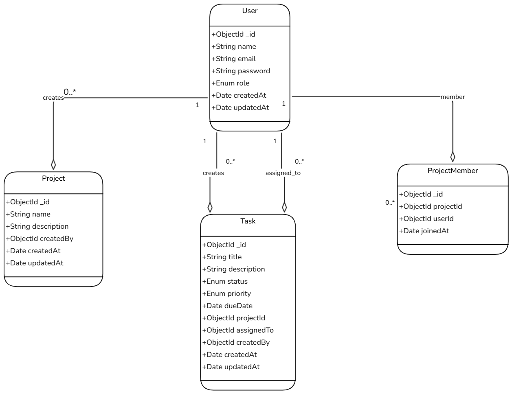
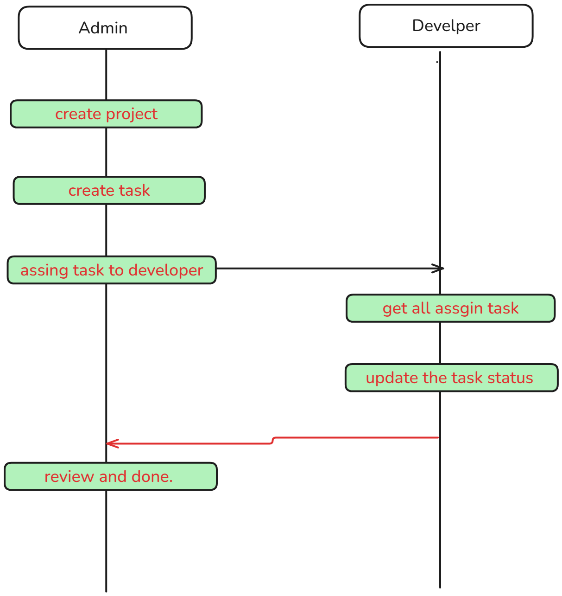
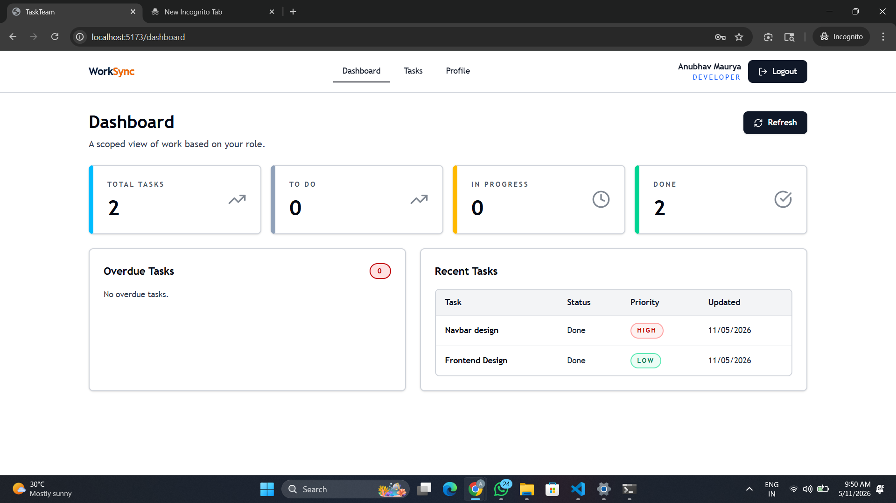
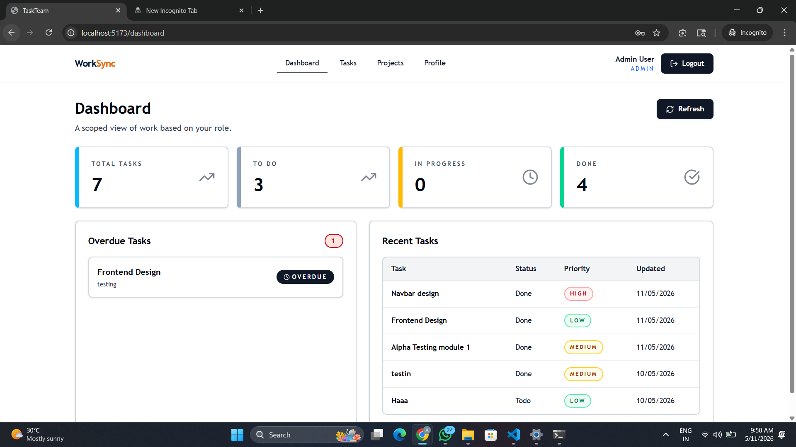
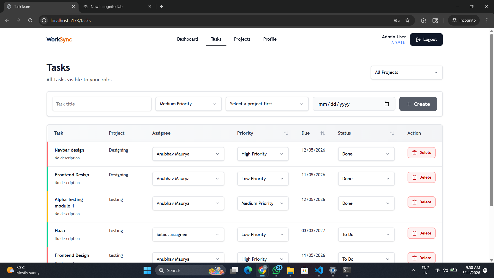
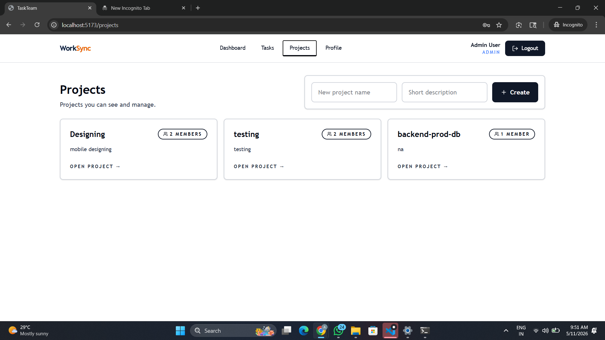
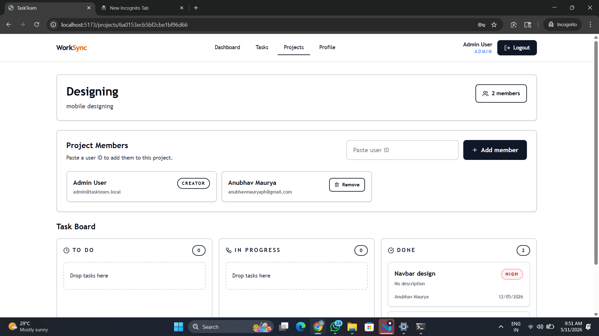

# TaskTeam

TaskTeam is a full-stack team task management platform with a React frontend and an Express + MongoDB backend.

It is built for role-based team collaboration where admins and project managers can create projects, assign tasks, and track progress, while developers can view and update assigned work.

## Key Highlights

- JWT-based authentication
- Role-based access control (`admin`, `project_manager`, `developer`)
- Project and member management
- Task creation, assignment, and status tracking
- Dashboard analytics by role

## Project Structure

- `client` - Vite + React application
- `server` - Express API with JWT auth, RBAC, and Mongoose models

## Visual Documentation

All README images are stored in a separate folder: `docs/images`.

### 1. ER Diagram (Database Design)



The ER diagram represents the core entities and relationships:

- `User`
	Stores identity and role (`admin`, `project_manager`, `developer`).
- `Project`
	Created by a user and acts as the top-level container for work.
- `Task`
	Belongs to a project, created by a user, and optionally assigned to another user.
- `ProjectMember`
	Connects users to projects to support many-to-many membership.

Relationship summary:

- One user can create many projects.
- One project can contain many tasks.
- One user can create many tasks.
- One user can be assigned many tasks.
- Many users can belong to many projects through `ProjectMember`.

### 2. Activity Diagram (Work Lifecycle)



The activity flow shown in the diagram:

1. Admin creates a project.
2. Admin creates tasks inside that project.
3. Admin assigns tasks to developers.
4. Developer fetches assigned tasks.
5. Developer updates task status.
6. Admin reviews the final work and marks completion.

This creates a clear execution loop between planning (admin) and delivery (developer).

### 3. Application Screenshots

#### Developer Dashboard View



Detailed notes:

- Shows role-scoped dashboard data for a developer.
- Metric cards summarize total tasks and status split (`to do`, `in progress`, `done`).
- Overdue panel highlights delayed items.
- Recent tasks table gives quick visibility into latest updates.

#### Admin Dashboard View



Detailed notes:

- Admin gets a wider system view with more tasks across projects.
- Overdue block helps prioritize intervention.
- Recent tasks table supports quick operational review.
- Navigation includes `Projects` management for administrative workflows.

#### Tasks Page



Detailed notes:

- Central table for task management.
- Supports quick task creation with title, priority, project, and due date.
- Inline controls allow changing assignee, priority, and status.
- Includes project filter and sorting for operational tracking.

#### Projects Page



Detailed notes:

- Lists all accessible projects.
- Each card shows project name, short description, and member count.
- New project form allows quick creation from the same screen.

#### Project Detail Page



Detailed notes:

- Displays selected project metadata.
- Includes project member management (add/remove members).
- Provides Kanban-style board (`To Do`, `In Progress`, `Done`) for live task movement.

## Setup

1. Install dependencies at the root:

```bash
npm install
```

2. Install workspace dependencies if needed:

```bash
npm install -w client
npm install -w server
```

3. Configure environment files:

- `server/.env`

```env
PORT=5000
JWT_SECRET=change-me
MONGODB_URI=mongodb://127.0.0.1:27017/taskteam
CLIENT_URL=http://localhost:5173
```

- `client/.env`

```env
VITE_API_URL=http://localhost:5000
```

4. Start MongoDB and make sure the target database is available.

5. Seed the initial admin user:

```bash
npm run seed -w server
```

6. Run both apps:

```bash
npm run dev
```

## Authentication

- Register and login endpoints:
	- `/api/auth/register`
	- `/api/auth/login`
- JWT token is stored in browser local storage.
- Axios client automatically sends token as `Bearer` header.

## Roles

- `admin`
- `project_manager`
- `developer`

## Seeded Admin

If no admin exists, the seed script creates one. You can override defaults with:

- `SEED_ADMIN_NAME`
- `SEED_ADMIN_EMAIL`
- `SEED_ADMIN_PASSWORD`

